# React + Vite
Live Demo: https://navoriqeats.netlify.app/

## About
Navoriq Eats is a modern restaurant and food ordering UI built using React and Vite.
It provides a clean and responsive interface for browsing menus, exploring dishes, and enhancing user experience.

## Installation
npm install
npm run dev

## Preview

  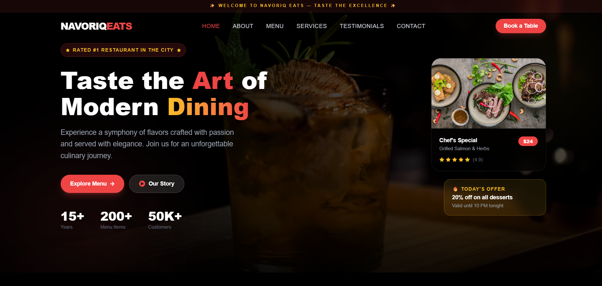

  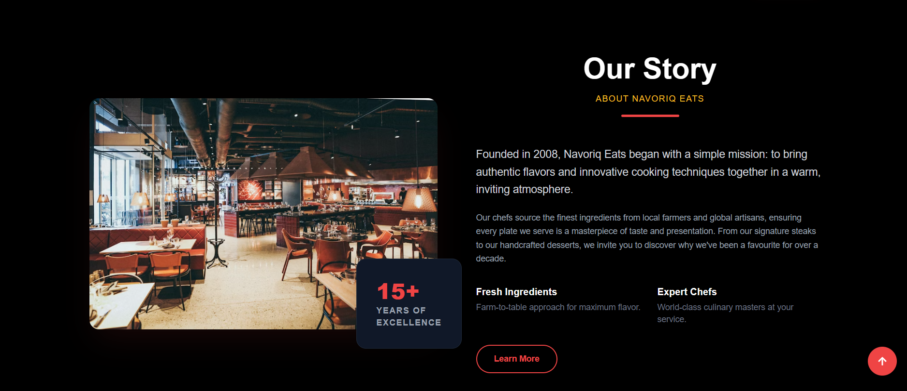
  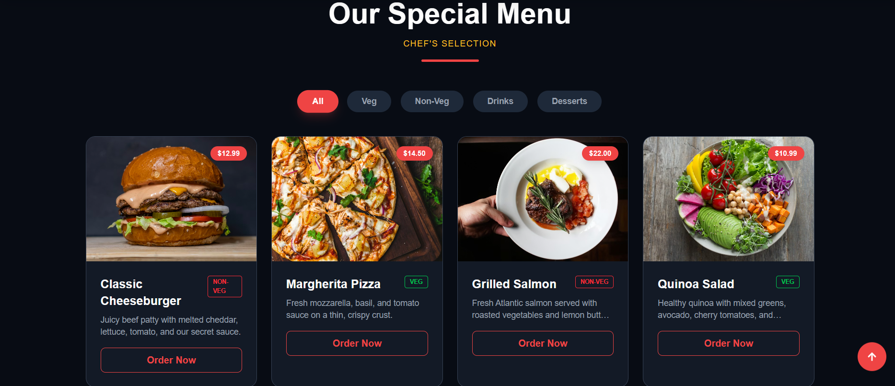
  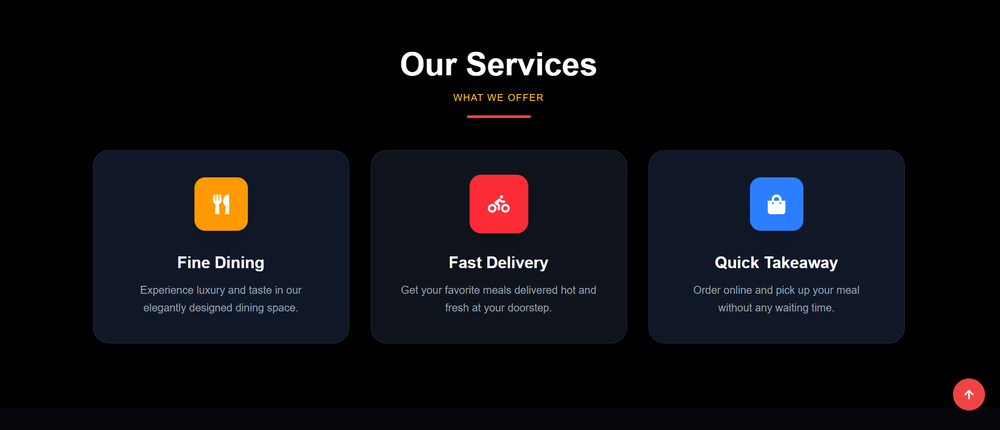

  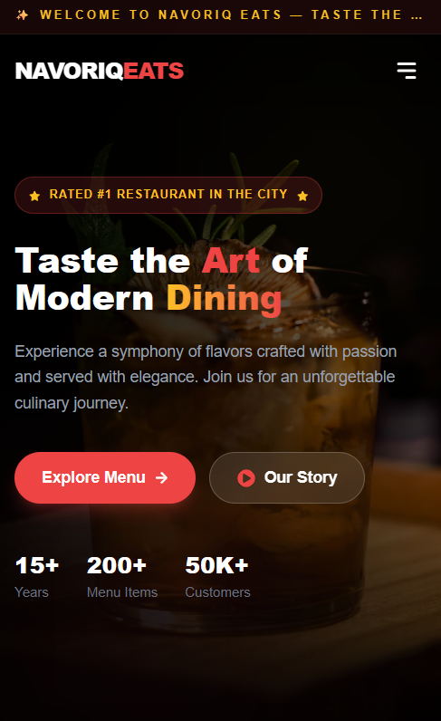
  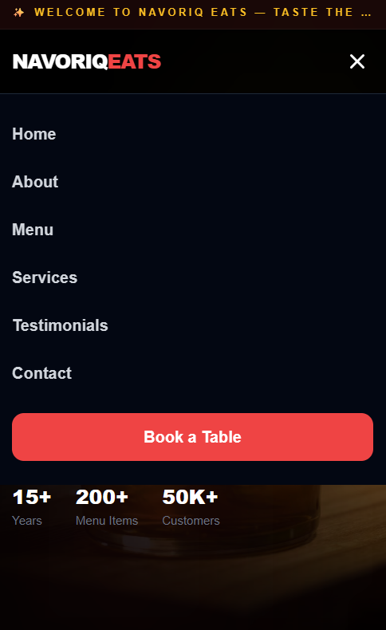
  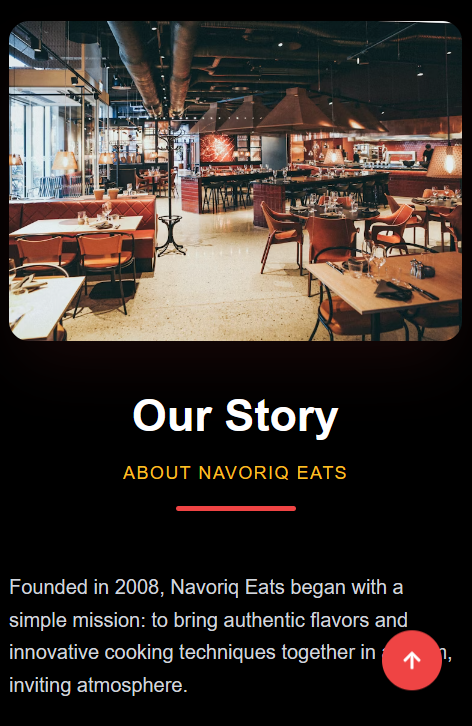
  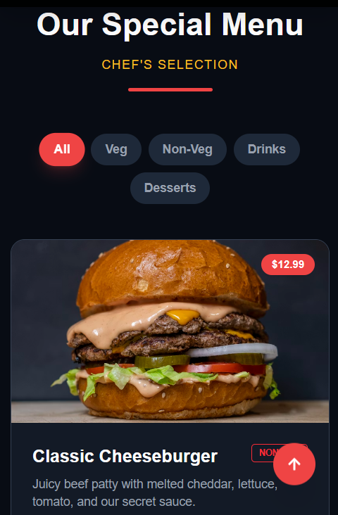
  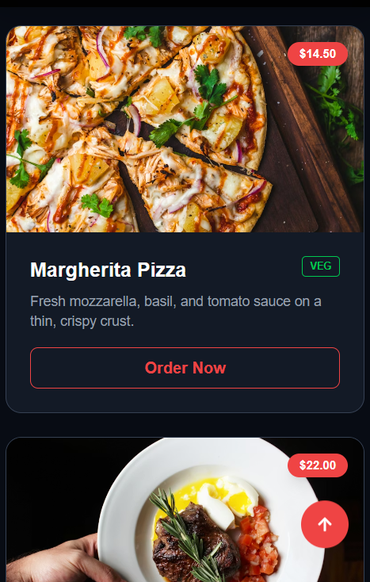
  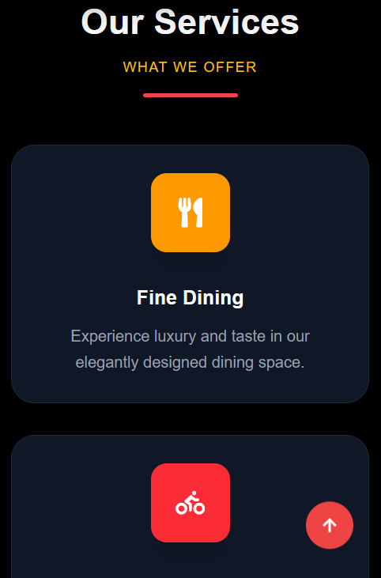

  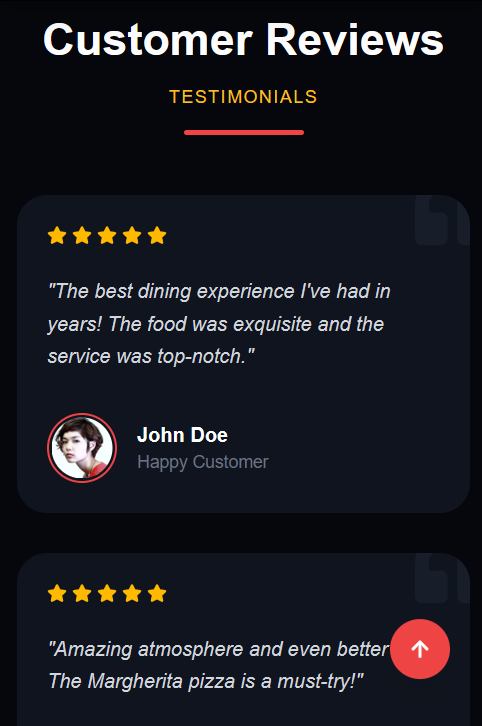
  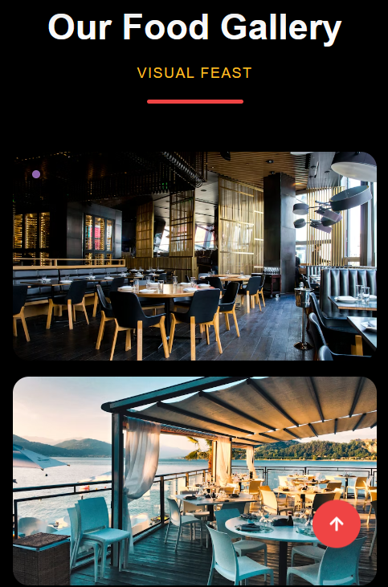
  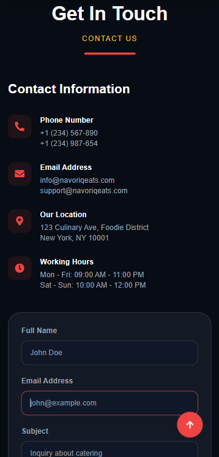
  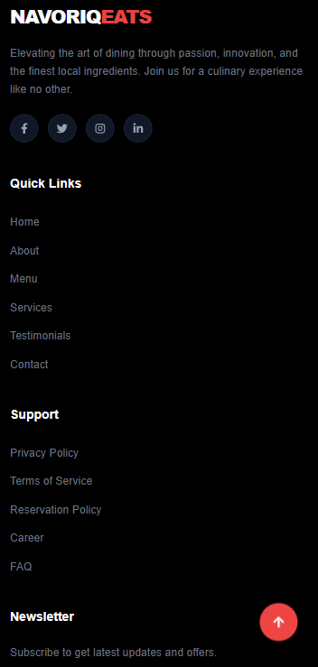

